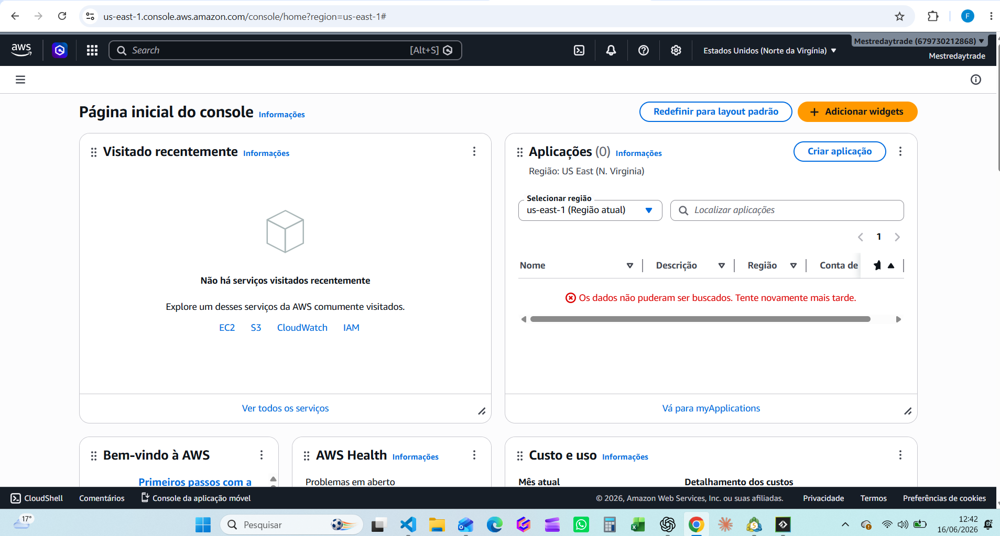

# 🚀 Gerenciamento de Instâncias Amazon EC2 na AWS para Algorithmic Trading

Este repositório foi desenvolvido como parte de um desafio prático na plataforma [DIO](https://dio.me), com o objetivo de consolidar conhecimentos sobre o provisionamento, configuração e gerenciamento de servidores virtuais na nuvem utilizando o **Amazon EC2 (Elastic Compute Cloud)** aplicado a cenários reais de automação e trading.

---

## 🎯 Objetivos do Projeto
*   **Provisionar** instâncias EC2 rodando ambiente Windows utilizando as boas práticas da AWS.
*   **Configurar** regras de firewall através de Security Groups para acesso via RDP (Remote Desktop Protocol).
*   **Documentar** o processo de infraestrutura necessário para execução de scripts de automação.
*   **Utilizar o GitHub** como portfólio técnico estruturado.

---

## 🛠️ Tecnologias e Conceitos Utilizados
*   **AWS Management Console**: Interface gráfica para gerenciamento dos recursos em nuvem.
*   **Amazon EC2**: Servidores virtuais (Instâncias) para execução contínua de aplicações.
*   **Amazon Machine Image (AMI)**: Modelos de sistemas operacionais — utilizando **Windows Server (Elegível para Free Tier)** para suporte nativo à API do MetaTrader 5 em Python.
*   **Key Pairs (Pares de Chaves)**: Chaves criptográficas para decodificação da senha de administrador.
*   **Security Groups**: Firewall virtual focado na abertura da porta **3389 (RDP)** restrita para acesso remoto seguro.

---

## 📋 Passo a Passo da Implementação

### 1. Criação e Configuração da Instância EC2 Windows
1.  Acesse o Console AWS e navegue até o serviço **EC2**.
2.  Clique em **Launch Instance** (Executar Instância).
3.  **Nome do Servidor**: Tag de identificação definida para o ambiente de execução dos robôs.
4.  **AMI (Sistema Operacional)**: Selecionado o `Windows Server 2025 Base` (ou versão equivalente elegível para o nível gratuito).
5.  **Tipo de Instância**: Escolhido `t2.micro` (ou `t3.micro`) para manter a infraestrutura dentro do *Free Tier*.

### 2. Segurança e Acesso Remoto
1.  **Key Pair**: Geração do arquivo `.pem` para realizar a descriptografia segura da senha inicial do Windows.
2.  **Network Settings (Security Group)**:
    *   Criado um grupo de segurança específico.
    *   Liberada a porta **3389 (RDP)** estritamente para o IP local atual do administrador, impedindo tentativas de acessos externos maliciosos.

### 3. Inicialização e Conexão de Área de Trabalho Remota
1.  A instância foi iniciada até atingir o status `Running` (Executando).
2.  Utilizando a ferramenta **Conexão de Área de Trabalho Remota (RDP)** nativa do sistema operacional, foi realizada a conexão ao IP público da instância fornecido pela AWS usando as credenciais configuradas.

---

## 💡 Insights e Aprendizados Adquiridos
*   **Compatibilidade de Bibliotecas**: Identificação de restrições de arquitetura. Bibliotecas específicas como `MetaTrader5` para Python possuem dependências exclusivas de ambiente Windows, tornando o Windows Server a escolha obrigatória em vez do Linux.
*   **Segurança de Redes**: A porta de gerenciamento remoto do Windows (3389) jamais deve ficar exposta para toda a internet (`0.0.0.0/0`). A filtragem por IP de origem no Security Group mitiga ataques de força bruta.
*   **Otimização de Recursos**: Como instâncias de nível gratuito possuem limitações de hardware (1 GB RAM), a desativação de elementos visuais e a limitação do histórico de gráficos no terminal de trading são essenciais para evitar sobrecarga.

---

## 🗂️ Evidências Práticas

| Tela do Dashboard EC2 |
| :---: |
|  |

---

## 📚 Links Úteis Utilizados
*   [Documentação Oficial: Gerenciando instâncias EC2 da Amazon](https://amazon.com)
*   [Guia Prático de Markdown do GitHub](https://github.com)

---
Feito com 💻 por [Felipe RicardoTorquato Moura](https://github.com/NakedSnake87)
